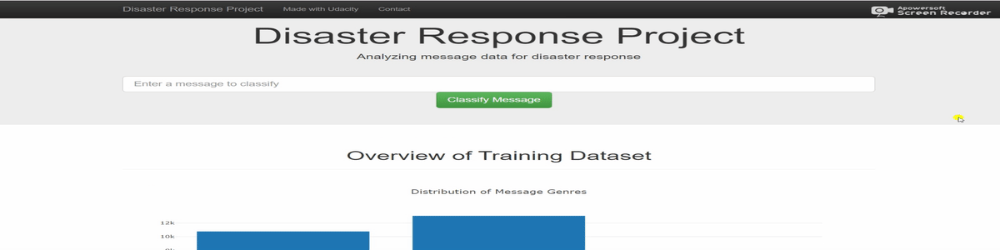

# Disaster-Response-Pipelines
## 📌**Demo**
<p align="center">
  
</p>


## 📌**Objective**
The objective of the project is to create a web application which will classify disaster messages.
## 📁 **Data/File Description**
- disaster_categories.csv - Contains the id, message that was sent and genre.
- disaster_messages.csv - Contains the id and the categories (related, offer, medical assistance..) the message belonged to.
- DisasterResponse.db - Database contain cleaned data
- process_data.py - Used for data cleaning and pre-processing
- train_classifier.py - Used to train the model
- classifier.pkl - Trained model
- run.py - To run Web App

## 🔑**Prerequisites**
All the required libraries are included in the file <code>requirements.txt</code>

## ⚠️**TechStack/framework used**
- Machine Learning
- Natural Language Processing
- Random Forest
- SQLite
- ETL
## 🚀Installation
1. Go to Project's root directory
2. Install required libraries.
```
pip install -r requirements.txt
```
3. To run ETL Pipeline that clean and store data
```
python data/process_data.py data/disaster_messages.csv data/disaster_categories.csv data/DisasterResponse.db
```
4. To run ML pipeline that trains the classifier model
```
python model/train_classifier.py data/DisasterResponse.db model/classifier.pkl
```
5. You can download the pre-trained model [here](https://drive.google.com/file/d/1bedkXCUKFGuCZ_rXi7O1RZJCRDoWKXEC/view?usp=sharing)

## ❤️**Owner**
Made With ❤️ by [Sidharth kumar mohanty](www.linkedin.com/in/sidharth178)

## 😖Troubleshoot
Any issues??? Feel free to ask.[Linkedin](www.linkedin.com/in/sidharth178)

If you find this repo useful,don't forget to give a ⭐
